# How the Setup Helper Works

> ⚠️ 這是**提案**的流程圖 —— `setup` skill 本身還沒建。步驟來源是 `docs/SETUP.md`,但順序重排過:**環境全部裝好且驗證可用,才准往下**;`BACKGROUND.md` 押到最後。

```mermaid
flowchart TD
    A["🚀 你說「幫我裝 Joblander」"] --> B0{"command -v claude<br/>查得到 CLI?"}
    B0 -->|"查不到"| B1["🙋 交棒:裝 Claude Code CLI<br/>install.sh 或 npm ⏎ 重開終端機"]
    B1 --> B0
    B0 -->|"查得到"| B["🔍 檢查 python3 · playwright"]
    B --> C{"都在?"}
    C -->|"缺 playwright"| D["▶️ pip3 install playwright<br/>playwright install chromium"]
    C -->|"缺 python3"| E["🙋 交棒:先裝好再回來"]
    C -->|"都在"| F["❓ 問 Gmail 位址<br/>+ launchd prefix"]
    D --> F
    E --> F

    F --> G["📝 寫 config.json"]
    G --> H["🙋 交棒 ①:Google 產 App Password"]
    H --> I["跑 security add-generic-password"]
    I --> J{"find-generic-password<br/>讀得回來?"}
    J -->|"讀不到"| H
    J -->|"讀得到"| K["🙋 交棒 ②:Settings → Connectors<br/>接 Gmail（唯讀）+ Calendar（只增不刪）"]

    K --> L["⏸ 等你說「接好了」"]
    L --> M["▶️ 當場驗證 claude -p<br/>--allowedTools 含 ToolSearch"]
    M --> N{"Gmail 工具<br/>回得出數字?"}
    N -->|"沒通"| K
    N -->|"通了"| O["✅ 環境全部就緒<br/>到這裡才准往下"]

    O --> P["🙋 交棒 ③:履歷 PDF 拖進來"]
    P --> Q{"有履歷?"}
    Q -->|"沒有"| R["退回逐欄問答模式<br/>（慢，但能跑）"]
    Q -->|"有"| S["📄 複製到 background/<br/>（已 gitignore）"]
    S --> T["🔍 讀 PDF 抽欄位"]
    T --> U["📝 applicant-profile.json 草稿"]
    R --> U

    U --> V["⏸ 整份攤開給你看"]
    V --> W{"哪裡錯?"}
    W -->|"有錯"| X["改掉那幾格"]
    X --> V
    W -->|"都對"| Y["✅ 寫入 applicant-profile.json"]

    Y --> Z["❓ 簽證/工作權/薪資期待<br/>（履歷上沒有，只能問）"]
    Z --> AC["📝 從履歷推 job-criteria.md 草稿<br/>職稱關鍵字·地點·學歷門檻"]
    AC --> AD["⏸ 給你看草稿"]
    AD --> AE{"對嗎?"}
    AE -->|"要改"| AF["調關鍵字/排除條件"]
    AF --> AD
    AE -->|"對"| AG["✅ 寫入 job-criteria.md"]

    AG --> AH["sources.json 原樣不動<br/>預設公司全留，不問"]
    AH --> AJ["🙋 交棒 ④:DevTools 抓<br/>ASML 的 sitecore auth_token"]
    AJ --> AK{"抓到了?"}
    AK -->|"沒抓到"| AL{"要放棄嗎?"}
    AL -->|"再試一次"| AJ
    AL -->|"放棄"| AM["📝 sources.json 裡 ASML<br/>設 enabled: false"]
    AK -->|"抓到"| AN["📝 token 寫進 config.json<br/>的 source_secrets.asml"]
    AM --> AN

    AN --> AO["▶️ 跑 scan_jobs.py discover"]
    AO --> AP{"today-jobs.md<br/>產出了?"}
    AP -->|"沒有"| AQ["🛑 停:貼錯誤給你，不硬猜"]
    AP -->|"有"| AR{"logs/ 有這次<br/>的執行紀錄?"}
    AR -->|"沒有"| AQ
    AR -->|"有"| AS{"信箱收到通知信?"}
    AS -->|"沒收到"| H
    AS -->|"收到"| AV["✅ 三個產物到齊<br/>（沒新職缺也一定有）"]

    AV --> AW["❓ 問你想幾點收職缺報告<br/>可多個時段，答「不用」就跳過"]
    AW --> AX["面試掃描自動排在<br/>每個時段 +20 分"]
    AX --> AY["📝 產兩個 plist<br/>絕對路徑、指向 python3"]
    AY --> AZ["🔍 跑驗證清單"]
    AZ --> BA["▶️ git status"]
    BA --> BB{"看到個人檔案?"}
    BB -->|"有"| BC["🛑 擋住:先修 .gitignore 再 commit"]
    BB -->|"沒有"| BE["📝 生 BACKGROUND.md 骨架<br/>公司·職稱·年份·專案標題"]
    BE --> BF["🙋 交棒 ⑤:STAR 內容你自己寫<br/>有面試之前不急"]
    BF --> BD["✅ 回報:裝了什麼<br/>BACKGROUND.md 還欠什麼"]
```



## 五個階段,每個階段都有一道閘門

| 階段 | 做什麼 | 過不了就不往下 |
|---|---|---|
| 1 環境 | Claude Code CLI · 依賴 · `config.json` · App Password · Connectors | CLI 查不到、Keychain 讀不回、Gmail 工具沒回應 |
| 2 履歷 | `applicant-profile.json` | 你沒逐欄看過 |
| 3 條件 | `job-criteria.md` · ASML token | 你沒確認草稿 |
| 4 跑一次 | `discover` | 三個產物少一個 |
| 5 收尾 | plist · 驗證清單 · `git status` · `BACKGROUND.md` 骨架 | 看到個人檔案 |

環境那關全部前置,是因為後面每一步都依賴它 —— App Password 沒設,第 4 關的通知信驗不了;連接器沒接,`interview-scan` 會靜靜地什麼都不做、不報錯,是最難查的失敗模式。

## `BACKGROUND.md` 押到最後

裝機階段用不到它。填申請表要的是 `applicant-profile.json`,那份從履歷就生得出來;`BACKGROUND.md` 的 STAR 敘事只有 `interview-prep` 會讀,而那要等到真的排到面試。

所以收尾時只生骨架(公司、職稱、年份、專案標題,全部從履歷抄)並列進待辦,不擋安裝完成。

## 第 4 關要看到三個產物

`today-jobs.md`、`logs/` 裡這次的執行紀錄、信箱裡的通知信 —— **三個都是無條件產出,今天沒有新職缺也一樣會有**,信裡就寫 `New candidates: none`。

所以少任何一個就是真的壞了,不是「今天剛好沒東西」。信沒收到直接退回 App Password 那關重設:`send_email_notification()` 讀不到 Keychain 會靜靜跳過、只印一行到 stdout,掃描照樣算成功。

## 履歷一份餵出三個檔

| 從履歷抽到的 | 餵進 | 你要做的 |
|---|---|---|
| 姓名·地址·電話·學歷·工作經歷 | `applicant-profile.json` | 看過、改錯字 |
| 職稱關鍵字·地點·學歷門檻 | `job-criteria.md` | 確認、加排除條件 |
| 公司·職稱·年份·專案標題 | `BACKGROUND.md` 骨架（收尾） | 填 STAR 內容（無法自動） |

履歷上**沒有**的只有三類:簽證/工作權答案、薪資期待、STAR 敘事。前兩個用問的,第三個交棒。

## What gets created / touched

```
Joblander/
├── config.json                                    ← 寫（環境階段）+ 回填 ASML token
├── background/
│   ├── <你的履歷>.pdf                              ← 你上傳
│   └── BACKGROUND.md                              ← 收尾才生骨架，STAR 內容交棒給你
├── automation/
│   ├── job-search/
│   │   ├── job-criteria.md                        ← 從履歷推草稿，你確認
│   │   ├── today-jobs.md                          ← discover 的產物 ①
│   │   └── _internal/
│   │       ├── sources.json                       ← 原樣不動（放棄 ASML 才改一格）
│   │       └── logs/                              ← discover 的產物 ②
│   └── job-apply/_internal/
│       └── applicant-profile.json                 ← 從履歷生草稿，你確認
└── docs/SETUP.md                                  ← 只讀，不改

你的信箱                                            ← discover 的產物 ③（通知信）
Claude Settings → Connectors                       ← Gmail（唯讀）+ Calendar（只增不刪）
~/Library/Keychain                                 ← 存 app password（不落地成檔案）
~/Library/LaunchAgents/<prefix>.jobdiscover.plist  ← 時段你指定
~/Library/LaunchAgents/<prefix>.interviewscan.plist ← 自動 +20 分
```

## 五個交棒點

Google App Password、Connectors 的 OAuth 授權、履歷檔本身、ASML 的 sitecore `auth_token`、`BACKGROUND.md` 的 STAR 內容。ASML 那個會一直重試到抓到,除非你說放棄 —— 抓到的 token 寫進 `config.json` 的 `source_secrets.asml`,`sources.json` 是公開的,只放佔位符。`BACKGROUND.md` 那個不擋完成,列進待辦就好。

履歷一進來就落在 `background/`,那層整個 gitignore,不會離開你的電腦。

排程時段你自己指定,面試掃描一律排在職缺掃描後 20 分鐘 —— 兩個 job 都寫 `ledger.json`,同分鐘觸發會互相蓋掉,這個間隔不開放調整。
