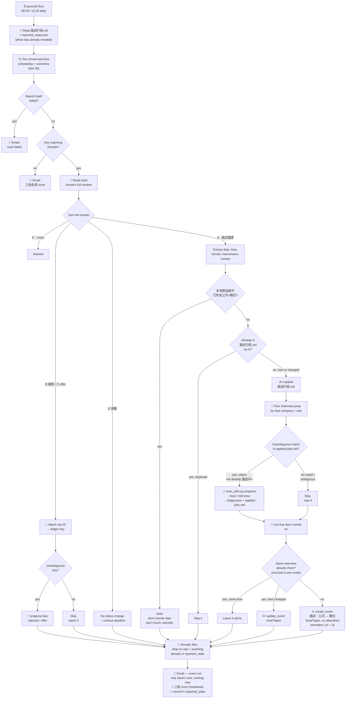

# How the Daily Gmail Interview Scan Works



## What gets touched

```
automation/interview-scan/
└── _internal/                       ← not meant for casual reading — engine, script, logs
    ├── run_scan.py                     ← what launchd actually runs (see below)
    ├── scan-gmail-interviews.sh        ← the claude -p invocation, run BY run_scan.py
    ├── prompt.md                       ← instructions given to the headless run each time (read)
    ├── send_email_notification.py      ← sends the summary email, on runs that have one to send
    ├── reported_state.json              ← every line already emailed; read + rewritten each run
    └── logs/launchd.log                ← stdout/stderr from every run

macOS Keychain
└── "job-scan-smtp-app-password"   ← same Gmail App Password as job-search's email (read, never written)

interview-prep/general/面試行程.md              ← read every run, written only when something's new/changed
interview-prep/<Company>/<Position>/   ← created by /interview-prep, only for genuinely new invitations
├── company_brief.md
├── position_intro.md
├── 模擬面試_QA.md
└── 基本知識.md

automation/job-search/
├── applied-jobs.md            ← read to find a matching job (never edited directly)
└── _internal/ledger.json      ← only touched via `scan_jobs.py progress <key> interview`, for a confirmed match

Google Calendar (<your-gmail-address>)
└── 面試｜<公司> — <職位>       ← created only when no matching event exists that day; updated if rescheduled

~/Library/LaunchAgents/
└── com.example.interviewscan.plist   ← the 08:20 / 13:20 schedule
```

Deliberately **:20 past the hour**, not on the hour: `com.example.jobdiscover` runs at 08:00/13:00 and writes `ledger.json` via `discover`, while this scan writes the same file via `progress`. They used to fire in the same minute, so a status update and a discovery run could clobber each other. Changed 2026-08-17 — keep the gap if you ever retime either job.

Read-only on Gmail (never sends/labels/deletes) — the outgoing email is sent via direct SMTP, not the Gmail connector. File writes are limited to `面試行程.md`, `_internal/reported_state.json`, whatever `/interview-prep` creates under `interview-prep/<Company>/<Position>/`, and — only via that one `scan_jobs.py progress` command, never a direct edit — `ledger.json`/`applied-jobs.md`. The run is restricted to exactly those tools, so there's no path for it to touch anything else even unattended.

## Outcome tracking (added 2026-08-17)

The scan reads more than interview invitations now. A second Gmail search covers rejections, offers and assessment requests, and each thread gets sorted into a bucket (A 面試 / B 婉拒 / C offer / D 測驗 / E noise) before anything acts on it.

Why it was added: the ledger had **35 applications, 33 of them `pending`, zero rejections ever recorded** — two dating back to February. `applied-jobs.md` still says `目前狀態要跟 Claude 說更新`, and that was the whole problem; status only moved when the user remembered to say so. The rejection emails were already sitting in Gmail.

Two rules keep it from doing damage:
- **Match on requisition ID, never on vibes.** Ledger keys embed the req ID (form: `<company-id>-<req-id>`) and employer emails quote it. No unambiguous key → skip and report it in the notification. A wrong key silently marks a live application dead; a missed one gets caught next time.
- **Bucket D changes no status.** `assessment` isn't a valid status, and a test request isn't an interview. It goes to the top of the notification email instead, since it's the one bucket with a deadline attached.

## Novelty filter (added 2026-08-24)

The email only carries what changed. Everything else is still checked, still written, still put on the calendar — it just isn't repeated at the user.

The problem it fixes is visible in `logs/launchd.log`: four consecutive runs each opened with the same four lines.

```
<Employer A> <date> 13:00 ... - already current, calendar already present
<Employer B> <date> 09:00 ... - already current, calendar already present
<Employer C> <date> 16:00 ... - already current, calendar already present
<Employer D> <date> 09:00 ... - already current, calendar already present
```

Twice a day, for four days, saying nothing. Because the search window is 3 days wide, the *same* email is read up to 6 times, so every rejection and every deadline reminder repeated too. A report that is 90% things you already know trains you to stop opening it — at which point the one line that matters goes unread.

Two filters, in `prompt.md` step 6:

1. **No-ops never print.** An `[INTERVIEW]` line whose whole outcome is `already current` / `calendar already present` is dropped. It survives only if something actually happened: `schedule file updated`, `calendar created`, `calendar updated`, `ledger -> interview`, `prep folder created`, `reschedule pending, untouched`.
2. **Already-said never repeats.** `_internal/reported_state.json` holds a signature per line the user has been emailed. Seen → suppressed. New → printed and recorded.

**Signatures contain no wording the agent chose.** That is the load-bearing detail. Role titles get rephrased run to run — the same TSMC interview was `NPTD HR intro` one day and `RD Engineer_NPTD AMT` the next, and the same Garmin item was worded three different ways in three consecutive runs. A signature carrying any of that never matches its own previous entry, and the line repeats forever. So a signature is company alias plus a hard value only:

| Section | Signature |
|---|---|
| `[INTERVIEW]` | `interview\|<company>\|<YYYY-MM-DD HH:MM>` |
| `[REJECTED]` | `rejected\|<company>\|<ledger key>` (or the email's date, when no key matched) |
| `[NEED ACTION]` | `action\|<company>\|<deadline>` (or a fixed keyword when there's no deadline) |

Because the interview signature carries the start time, a **reschedule changes the signature** and correctly reports as new. That's the case the filter must never swallow.

Deadlines are the one thing allowed to repeat: a `[NEED ACTION]` item comes back on its deadline day and each day it's overdue — at most once a day, prefixed `DUE TODAY -` / `OVERDUE -` — then stops for good 7 days past due.

**The email still goes out every run** (user's call, 2026-08-24) — a run with nothing new sends the same report with all three sections reading `none`. That mail is a heartbeat: it costs one glance to delete and it makes a *missing* mail unambiguously mean the scan broke, which is the confusion `run_scan.py` exists to prevent. What the filter removes is the body's content, not the send. If `reported_state.json` can't be read or written, the run **reports everything** and says so in `[NEED ACTION]`: a noisy email is recoverable, a swallowed interview invitation isn't.

**The report is wrapped in a ``` fence, on purpose.** `launchd.log` is one long append-only file and the mail body is `text/plain`, so the fence isn't rendered anywhere — it's there as a visible delimiter marking where a run's report begins and ends. Required by `prompt.md` step 6g; `send_email_notification.py` passes the body through verbatim. A `strip_code_fences()` helper existed for about ten minutes on 2026-08-24 on the assumption this was a formatting leak — it was removed, and the sender's docstring says so. Don't re-add it.

**Subject timestamps come from `run_scan.py`, not the agent.** The agent has no clock, so when the prompt asked it for `Interview scan - <YYYY-MM-DD HH:MM>` it invented plausible times — a run at 08:33 mailed `14:05`, one at 10:56 mailed `22:30`, which made subjects useless for ordering mail or matching a message to its log block. Now `run_scan.py` exports `INTERVIEW_SCAN_RUN_TS` (the same string as the `=== interview-scan <ts> ===` log header), the prompt tells the agent to pass the literal token `{ts}`, and `send_email_notification.py` substitutes it. If a run invents a time anyway the sender overwrites it and says so on stdout; a hand-started run with no env var falls back to the clock. The `⚠️ Interview scan FAILED` heartbeat is stamped in Python and is left alone.

## Reschedule hold (added 2026-08-19)

`面試行程.md` can carry a `## 🔒 改期協調中` section listing interviews where a reschedule has been
requested but the other side hasn't confirmed. While an interview sits there, the scan reads its
invitation email as **already known** — it does not rewrite the date, does not move the row into
`已確認排程`, and skips the calendar step entirely (`prompt.md` step 4's last bullet and step 5.6.0).

Why it exists: the scan previously had only two states — what the email says, and what the file says —
and resolved any mismatch in the email's favour. So a pending reschedule looked identical to a stale
file, and the next run would faithfully restore the very time being moved away from, then create a
calendar event for it. Found the first time a new invitation collided with an interview already
confirmed 30 minutes later the same morning, and one of them had to move.

The hold releases itself: once a confirmation email arrives carrying a genuinely new time, the scan
updates the file, removes the item from the section, and proceeds normally. Nothing to remember to
switch off.

## Calendar step (added 2026-08-17)

Three things make this step trickier than it looks, all handled in `prompt.md` step 5.6:

1. **Recruiters send their own invites.** Every interview scheduled so far was already on the calendar before this step existed, auto-added from the recruiter's invitation — with titles like `<your name> + <Employer>` or `Your in-person interview at <Employer> for…`, which match nothing you would have written. So dedup lists *every* event on the interview day and matches on company alias + date, not on a title pattern.
2. **The calendar's default timezone is `America/Los_Angeles`.** Every create/update must pass `timeZone: "Asia/Taipei"` explicitly or the event lands 15 hours off.
3. **No attendees, ever.** Adding the recruiter's address would email them an invitation from you. Contact details go in the description. `delete_event` is deliberately not in the script's `--allowedTools`, so the unattended run cannot remove anything.

Notification channel is email only (2026-08-17) — the macOS `osascript` banner notification was removed project-wide (both here and in the job-search scan) until told otherwise.

Reorganized 2026-08-17: everything this automation reads/writes moved into `_internal/`; only this WORKFLOW.md stays at the top level.

`run_scan.py` sits between launchd and the shell script for two reasons. macOS TCC will not give `/bin/bash` access to `~/Desktop`, so a bash-fronted launchd job dies at exit 126 before its first line — `/opt/homebrew/bin/python3` holds that grant and its children inherit it. And the scan's success email is its last step, so a crash produces silence that looks exactly like a quiet day; the wrapper emails on any non-zero exit or a 20-minute timeout, from outside the process that can die. Both learned on 2026-08-18, when the job turned out to have never run successfully.
