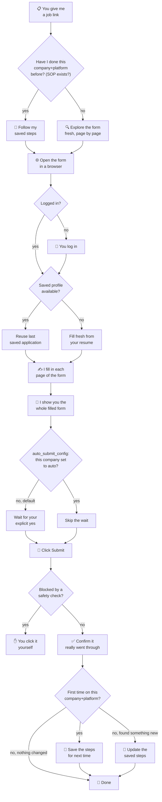

# How the Job Application Helper Works



## What gets touched

```
~/.job-apply-sessions/<job-id>/     ← throwaway browser session for this one run
automation/job-apply/
└── _internal/                       ← not meant for casual reading — engine + data
    ├── playwright_script.py            ← the engine that drives the browser
    ├── applicant_profile.json          ← your info (read, not written)
    ├── auto_submit_config.json         ← per-company auto vs. ask-first (read)
    └── sop/<company>-<platform>.md     ← saved steps for that company's form
                                            (written the first time, reused after)
```

Nothing gets submitted without you seeing the filled form first — unless that specific company is explicitly flagged `auto` in `auto_submit_config.json`, and even then you still get shown what was sent, right after.

Reorganized 2026-08-17: everything the agent reads/writes moved into `_internal/`; only this WORKFLOW.md stays at the top level.
