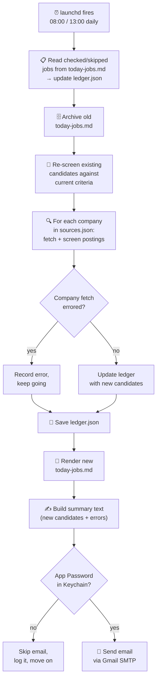

# How the Daily Job-Search Scan Works



## What gets touched

```
automation/job-search/
├── job-criteria.md         ← screening rules (read, user-edited)
├── today-jobs.md           ← today's checklist for the user (written fresh)
├── applied-jobs.md         ← full application history (written on progress updates)
├── target-companies.md     ← company list (user-facing reference)
└── _internal/               ← not meant for casual reading — engine, data, logs
    ├── scan_jobs.py            ← what launchd actually runs (discover command)
    ├── sources.json            ← company/ATS endpoint config (read)
    ├── ledger.json             ← every job ever seen + its status (read/write)
    ├── ledger.bak.json         ← rolling backup, rewritten every save
    ├── archive/                ← yesterday's today-jobs.md gets moved here
    └── logs/launchd.log        ← stdout/stderr from every run

macOS Keychain
└── "job-scan-smtp-app-password"   ← Gmail App Password (read, never written by the script)

~/Library/LaunchAgents/
└── com.example.jobdiscover.plist   ← the 08:00 / 13:00 schedule
```

Email is best-effort — a failed send (missing Keychain entry, network hiccup) never blocks the scan; it just gets logged and skipped.

Every free-text value going into `today-jobs.md` (job title, company, error message) is escaped before being placed in a table cell, so a literal `|` in a real posting title can't break the row.

Reorganized 2026-08-17: engine code, raw data, and logs moved into `_internal/`; only the files the user actually reads/edits (checklist, criteria, history, company list) stay at the top level.
