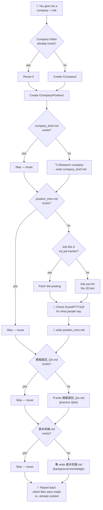

# How the Interview Prep Helper Works



## What gets created

```
interview_prep/
└── <Company>/
    ├── company_brief.md          ← what the company does (once per company)
    └── <Position>/
        ├── position_intro.md     ← the job itself + forum sentiment
        ├── 模擬面試_QA.md         ← practice interview Q&A
        └── 基本知識.md            ← background knowledge cheat sheet
```

Each file is written once and reused after that — re-running the skill on the same company/role never overwrites existing files unless you explicitly ask for a refresh.
